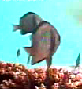
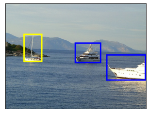
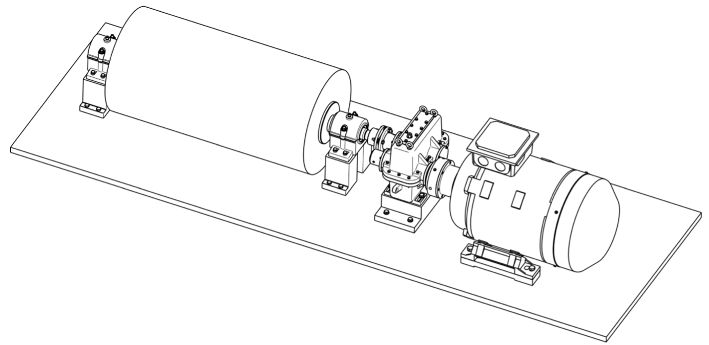

<h2> Hi there, I'm Maximilian Vieweg 江宇阳!</h2>
<p><em>
I'm an Erasmus Mundus Robotics Engineering Master student at the <a href="https://www.master-mir.eu/">Técnico Lisboa and the Université de Toulon</a> applying for 2023 summer internship programmes right now. <br>
Among top 15% of student cohort during my bachelor's at the Technical University of Vienna following an individual study plan, while taking courses in Robotics, Microcontrollers and Machine design. 
</em></p>

[](mailto:maximilian.vieweg@gmail.com)
[](https://www.linkedin.com/in/mavie/)
[](https://github.com/majvie)

### 🌱 My best projects

-  <a href="https://www.acin.tuwien.ac.at/en/project/optofence/">Trajectory Prediction of Unmanned Aerial Vehicles for image stabilization of a telescope system</a> as Bachelor Thesis. I researched state of the art methods and implemented a program to improve on the previous system using Kalman Filters, OpenCV and C++.
- <a href="https://github.com/majvie/deep_learning_notebooks">fish classification using CNNs</a> – This project involves using CNNs and PyTorch to classify fish images into different categories. We will train a model on a dataset of fish images and use it to predict the class of new, unseen images. Finally its performance is compared to a fine-tuned AlexNet and a MobileNet to explore Transfer Learning.
- <a href="https://github.com/majvie/deep_learning_notebooks">detecting sailboats at sea</a> – A Faster R-CNN is trained to detect and categorize maritime objects, such as sailboats and buoys, at sea. Each detection is visualised with a bounding box and relevant metrics are displayed next to the image category. For this purpose images are filtered from the Pascal VOC for training.
- <a href="https://github.com/majvie/transmission_box">Transmission Box</a> – Design, Calculations and Dimensioning of a Transmission Box, clutches and roll for roll forming according to DIN and ISO standards. As the team leader I was responsible for the calculations and design of parts of the transmission as well as the hydraulically actuated multi-plate clutch and for project management. 

### 💡 A little more about me...  

```javascript
const max = {
  code: ["Python", "C++", "C", "Java"],
  technologies: ["AWS", "REST APIs", "CATIA", "3D Printing", "STM32"],
  languages: {
    German: "C2",
    English: "C2",
    Chinese: "HSK 4 eq. B2",
    French: "B2", 
    Spanish: "B1/B2"
  }
}
```


---
